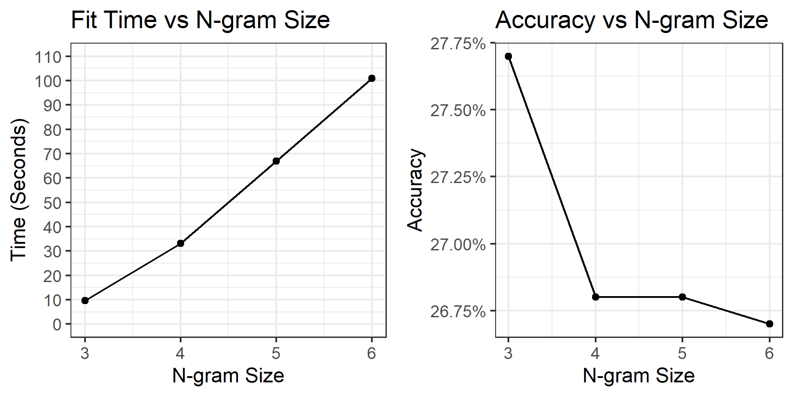

Text Prediction using Stupid Back-off Model
========================================================
author: John Goodwin
date: 6/7/2021
autosize: true

Problem
========================================================

Have you ever been frustrated when tediously typing out every word of a text, email, or comment? The predictive text model built for this project can eliminate this frustration by providing word or even sentence suggestions based on a word or phrase.

This presentation will give you:
- An introduction to the Stupid Back-off model used for prediction
- The Shiny application designed around the model

Model
========================================================
<small>
Stupid Back-off (SBO) models use sequences of words (n-grams) to estimate the probability of an upcoming word. During training, there are two parameters that can influence model accuracy and complexity:
- Lambda: the penalization parameter
- N: the size of the n-grams used for estimation

A grid search found the following:
- Lambda had relatively little impact on accuracy but almost no impact on fit time
- N values above 3 lead to less accurate models, but with significant time penalties (next slide)
- Training on more data had a more significant impact on model accuracy than either tuning parameter
</small>

N-gram Size Impact on Accuracy and Fit Time
========================================================
<small>
Model performance deteriorates while model fit time ballooned as n-gram size increased
</small>

<small>
Results based on a 30K row sample of the training data.
</small>

Shiny Application
========================================================
<small>
The final model was packaged up in a [Shiny application](https://wiscodisco5.shinyapps.io/swiftkey-nlp-project/) that offers two main functions:
- Next Word prediction -- suggests 3 words based off a word or phrase
- "Babbles" -- sentence completion based off a word or phrase

Predictions can be generated by: 

1. Providing text to the `Text Input` box
2. Clicking `Run` to generate predictions
</small>
***

